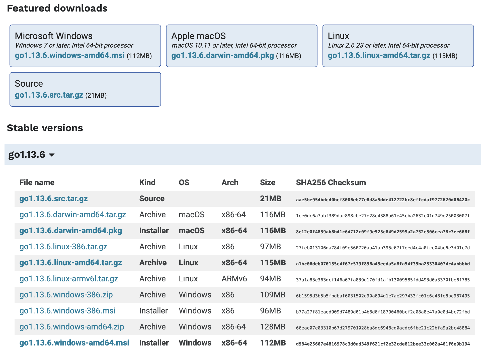

# 安装Golang

针对macOS，默认使用`Homebrew`工具安装软件。针对Linux系列及Windows系统，默认使用压缩包安装最新版软件。


## 卸载旧版本Go

如果是在已经安装Go的机器上安装，需要先卸载旧版本。


### Linux系列

默认安装路径为`/usr/local/go`，如果需要卸载，直接删除该目录。

删除后，根据就的安装方式，修改`/etc/profile`或`~/.profile`文件中增加的Go路径配置参数。

如果是参照本文进行的安装，可以不用修改环境变量。


### macOS

- 如果是参考[官网安装方式](https://golang.org/doc/install)安装的旧版本，卸载方式同`Linux系列`
- 如果是使用`brew`安装，则不需要卸载，直接使用`brew update && brew upgrade`进行更新


### Windows

默认安装路径为`C:\go`，如果需要卸载，直接删除该目录。

删除后，删除对应的Go路径配置参数。默认为：系统控制面板-》高级-》环境变量


## 安装新版本Go

除macOS系统外，安装之前，需要先至[Golang官网](https://golang.org/dl/)下载对应的软件包。后续安装说明以版本`1.13.6`为例。




### macOS

确认个人环境变量包含`/usr/local/bin`：

```
$ echo $PATH
/usr/local/sbin:/usr/local/bin:/usr/bin:/bin:/usr/sbin:/sbin:
```

如果不包含该目录，修改`.zshrc`文件，增加相应赋值。


针对macOS系统，建议使用macOS系统下的软件管理神器`Homebrew`进行安装，在[参照官网安装brew](https://brew.sh)后，可直接使用以下命令安装Golang：

```
brew update
brew install go
```

安装后，工具会默认在`/usr/local/bin`目录下为可执行文件创建链接，可使用以下`go version`命令验证：

```
$ go version
go version go1.13.6 darwin/amd64
```


如果无法找到可执行命令，可使用以下命令重新创建链接文件：

```
$ brew link go
```

运行后，`/usr/local/bin`应该存在类似如下命令：

```
$ ls /usr/local/bin/go*
go -> ../Cellar/go/1.13.6/bin/go
gofmt -> ../Cellar/go/1.13.6/bin/gofmt
```


### Linux系列

将压缩包解压至`/usr/local`目录：

```
sudo tar -C /usr/local -xzvf go1.13.6.linux-amd64.tar.gz
```


为可执行命令创建链接：

```
cd /usr/local/bin
sudo ln -sf ../go/bin/go ./
sudo ln -sf ../go/bin/gofmt ./
```

因为Linux系列操作系统中，默认环境变量包含`/usr/local/bin`，为可执行文件创建链接后，不需要再另外设置环境变量。


### Windows

下载压缩包，并将压缩包解压至`c:\go`目录。

将可执行文件目录`C:\go`增加至个人的`PATH`环境变量中。


## 验证安装环境

创建目录`src/hello`，并在该目录下创建`hello.go`文件，内容如下：

```
package main

import "fmt"

func main() {
	fmt.Printf("Hello,World!\n")
}
```

使用终端工具，进入`hello.go`文件所在目录，并执行：

```
$ go run hello.go
Hello,World!
```

如果看到终端中的`Hello,World!`，则说明安装成功。


----

本文原始来源 [Endial Fang](https://github.com/endial) @ [Github.com](https://github.com) ([项目地址](https://github.com/endial/study-golang.git))

