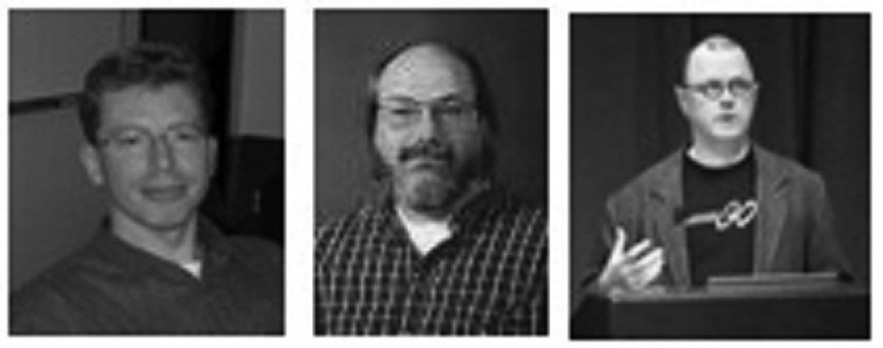

# 前言

Go 语言起源 2007 年，并于 2009 年正式对外发布。它从 2009 年 9 月 21 日开始作为谷歌公司 20% 兼职项目，即相关员工利用 20% 的空余时间来参与 Go 语言的研发工作。该项目的三位领导者均是著名的 IT 工程师：Robert Griesemer，参与开发 Java HotSpot 虚拟机；Rob Pike，Go 语言项目总负责人，贝尔实验室 Unix 团队成员，参与的项目包括 Plan 9，Inferno 操作系统和 Limbo 编程语言；Ken Thompson，贝尔实验室 Unix 团队成员，C 语言、Unix 和 Plan 9 的创始人之一，与 Rob Pike 共同开发了 UTF-8 字符集规范。自 2008 年 1 月起，Ken Thompson 就开始研发一款以 C 语言为目标结果的编译器来拓展 Go 语言的设计思想。

**这是一个由计算机领域 “发明之父” 所组成的黄金团队，他们对系统编程语言，操作系统和并行都有着非常深刻的见解**

图 1.1 Go 语言设计者：Griesemer、Thompson 和 Pike

在 2008 年年中，Go 语言的设计工作接近尾声，一些员工开始以全职工作状态投入到这个项目的编译器和运行实现上。Ian Lance Taylor 也加入到了开发团队中，并于 2008 年 5 月创建了一个 gcc 前端。

Russ Cox 加入开发团队后着手语言和类库方面的开发，也就是 Go 语言的标准包。在 2009 年 10 月 30 日，Rob Pike 以 Google Techtalk 的形式第一次向人们宣告了 Go 语言的存在。

直到 2009 年 11 月 10 日，开发团队将 Go 语言项目以 BSD-style 授权（完全开源）正式公布了 Linux 和 Mac OS X 平台上的版本。Hector Chu 于同年 11 月 22 日公布了 Windows 版本。

作为一个开源项目，Go 语言借助开源社区的有生力量达到快速地发展，并吸引更多的开发者来使用并改善它。自该开源项目发布以来，超过 200 名非谷歌员工的贡献者对 Go 语言核心部分提交了超过 1000 个修改建议。在过去的 18 个月里，又有 150 开发者贡献了新的核心代码。这俨然形成了世界上最大的开源团队，并使该项目跻身 [Ohloh](http://www.ohloh.net/) 前 2% 的行列。大约在 2011 年 4 月 10 日，谷歌开始抽调员工进入全职开发 Go 语言项目。开源化的语言显然能够让更多的开发者参与其中并加速它的发展速度。Andrew Gerrand 在 2010 年加入到开发团队中成为共同开发者与支持者。

在 Go 语言在 2010 年 1 月 8 日被 [Tiobe](http://www.tiobe.com/)（闻名于它的编程语言流行程度排名）宣布为 “2009 年年度语言” 后，引起各界很大的反响。目前 Go 语言在这项排名中的最高记录是在 2017 年 1 月创下的第13名，流行程度 2.325%。

### 时间轴：

- 2007 年 9 月 21 日：雏形设计
- 2009 年 11 月 10日：首次公开发布
- 2010 年 1 月 8 日：当选 2009 年年度语言
- 2010 年 5 月：谷歌投入使用
- 2011 年 5 月 5 日：Google App Engine 支持 Go 语言

从 2010 年 5 月起，谷歌开始将 Go 语言投入到后端基础设施的实际开发中，例如开发用于管理后端复杂环境的项目。有句话叫 “吃你自己的狗食”，这也体现了谷歌确实想要投资这门语言，并认为它是有生产价值的。

Go 语言的官方网站是 [golang.org](http://golang.org/)，这个站点采用 Python 作为前端，并且使用 Go 语言自带的工具 godoc 运行在 Google App Engine 上来作为 Web 服务器提供文本内容。在官网的首页有一个功能叫做 Go Playground，是一个 Go 代码的简单编辑器的沙盒，它可以在没有安装 Go 语言的情况下在你的浏览器中编译并运行 Go，它提供了一些示例，其中包括国际惯例 “Hello, World!”。

更多的信息详见 [github.com/golang/go](https://github.com/golang/go)，Go 项目 Bug 追踪和功能预期详见 [github.com/golang/go/issues](https://github.com/golang/go/issues)。

Go 通过以下的 Logo 来展示它的速度，并以囊地鼠（Gopher）作为它的吉祥物。

## Go语言特点

Go语言尤其适合编写网络服务相关基础设施，同时也适合开发一些工具软件和系统软件。 但是Go语言确实是一个通用的编程语言，它也可以用在图形图像驱动编程、移动应用程序开发 和机器学习等诸多领域。目前Go语言已经成为受欢迎的作为无类型的脚本语言的替代者： 因为Go编写的程序通常比脚本语言运行的更快也更安全，而且很少会发生意外的类型错误。

Go语言还是一个开源的项目，可以免费获取编译器、库、配套工具的源代码。 Go语言的贡献者来自一个活跃的全球社区。Go语言可以运行在类[UNIX](http://doc.cat-v.org/unix/)系统—— 比如[Linux](http://www.linux.org/)、[FreeBSD](https://www.freebsd.org/)、[OpenBSD](http://www.openbsd.org/)、[Mac OSX](http://www.apple.com/cn/osx/)——和[Plan9](http://plan9.bell-labs.com/plan9/)系统和[Microsoft Windows](https://www.microsoft.com/zh-cn/windows/)操作系统之上。 Go语言编写的程序无需修改就可以运行在上面这些环境。

Go是一种新的语言，一种并发的、带垃圾回收的、快速编译的语言。它具有以下特点：

- 它可以在一台计算机上用几秒钟的时间编译一个大型的Go程序。
- Go为软件构造提供了一种模型，它使依赖分析更加容易，且避免了大部分C风格include文件与库的开头。
- Go是静态类型的语言，它的类型系统没有层级。因此用户不需要在定义类型之间的关系上花费时间，这样感觉起来比典型的面向对象语言更轻量级。
- Go完全是垃圾回收型的语言，并为并发执行与通信提供了基本的支持。
- 按照其设计，Go打算为多核机器上系统软件的构造提供一种方法。

Go是一种编译型语言，它结合了解释型语言的游刃有余，动态类型语言的开发效率，以及静态类型的安全性。它也打算成为现代的，支持网络与多核计算的语言。要满足这些目标，需要解决一些语言上的问题：一个富有表达能力但轻量级的类型系统，并发与垃圾回收机制，严格的依赖规范等等。这些无法通过库或工具解决好，因此Go也就应运而生了。

## 学习资源

谷歌邮件列表 [golang-nuts](http://groups.google.com/group/golang-nuts/) 非常活跃，每天的讨论和问题解答数以百计。

关于 Go 语言在 Google App Engine 的应用，这里有一个单独的邮件列表 [google-appengine-go](https://groups.google.com/forum/#!forum/google-appengine-go)，不过 2 个邮件列表的讨论内容并不是分得很清楚，都会涉及到相关的话题。[go-lang.cat-v.org/](http://go-lang.cat-v.org/) 是 Go 语言开发社区的资源站，[irc.freenode.net](http://irc.freenode.net/) 的#go-nuts 是官方的 Go IRC 频道。

[@golang](https://twitter.com/golang) 是 Go 语言在 Twitter 的官方帐号，大家一般使用 #golang 作为话题标签。

这里还有一个在 Linked-in 的小组：[www.linkedin.com/groups?gid=2524765&trk=myg_ugrp_ovr](http://www.linkedin.com/groups?gid=2524765&trk=myg_ugrp_ovr)。

Go 编程语言的维基百科：[en.wikipedia.org/wiki/Go_(programming_language)](http://en.wikipedia.org/wiki/Go_(programming_language))

Go 语言相关资源的搜索引擎页面：[gowalker.org](https://gowalker.org/)

Go 语言还有一个运行在 Google App Engine 上的 [Go Tour](http://tour.golang.org/)，你也可以通过执行命令 `go install go-tour.googlecode.com/hg/gotour` 安装到你的本地机器上。对于中文读者，可以访问该指南的 [中文版本](http://go-tour-zh.appspot.com/)，或通过命令 `go install https://bitbucket.org/mikespook/go-tour-zh/gotour` 进行安装。