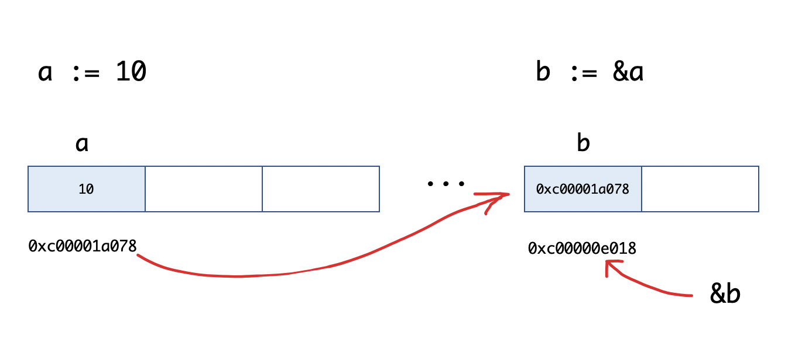

# 指针

任何程序数据载入内存后，在内存都有他们的地址，这就是指针。而为了保存一个数据在内存中的地址，我们就需要指针变量。


## Go语言中的指针

指针（pointer）在 Go 语言中可以被拆分为两个核心概念：

- 类型指针，允许对这个指针类型的数据进行修改，传递数据可以直接使用指针，而无须拷贝数据，类型指针不能进行偏移和运算。
- 切片，由指向起始元素的原始指针、元素数量和容量组成。

受益于这样的约束和拆分，Go 语言的指针类型变量即拥有指针高效访问的特点，又不会发生指针偏移，从而避免了非法修改关键性数据的问题。同时，垃圾回收也比较容易对不会发生偏移的指针进行检索和回收。

切片比原始指针具备更强大的特性，而且更为安全。切片在发生越界时，运行时会报出宕机，并打出堆栈，而原始指针只会崩溃。

区别于 C/C++ 中的指针，Go 语言中的指针不能进行偏移和运算，是安全指针。Go 语言中的指针操作非常简单，我们只需要记住两个符号：**`&`（取地址）**和**`*`（根据地址取值**）。

要搞明白 Go 语言中的指针需要先知道3个概念：指针地址、指针类型和指针取值。


## 指针地址和指针类型

每个变量在运行时都拥有一个地址，这个地址代表变量在内存中的位置。Go 语言中使用`&`字符放在变量前面对变量进行“取地址”操作。 Go 语言中的值类型（int、float、bool、string、array、struct）都有对应的指针类型，如：`*int`、`*int64`、`*string`等。

取变量指针的语法如下：

```go
ptr := &v    // v的类型为T
```

其中：

- v:代表被取地址的变量，类型为`T`
- ptr:用于接收地址的变量，ptr的类型就为`*T`，称做T的指针类型。*代表指针。

举个例子：

```go
func main() {
	a := 10
	b := &a
	fmt.Printf("a:%d ptr:%p\n", a, &a) // a:10 ptr:0xc00001a078
	fmt.Printf("b:%p type:%T\n", b, b) // b:0xc00001a078 type:*int
	fmt.Println(&b)                    // 0xc00000e018
}
```

我们来看一下`b := &a`的图示：


## 指针取值

在对普通变量使用&操作符取地址后会获得这个变量的指针，然后可以对指针使用`*`操作，也就是指针取值，代码如下。

```go
func main() {
	//指针取值
	a := 10
	b := &a // 取变量a的地址，将指针保存到b中
	fmt.Printf("type of b:%T\n", b)
	c := *b // 指针取值（根据指针去内存取值）
	fmt.Printf("type of c:%T\n", c)
	fmt.Printf("value of c:%v\n", c)
}
```

输出如下：

```go
type of b:*int
type of c:int
value of c:10
```

**总结：** 取地址操作符`&`和取值操作符`*`是一对互补操作符，`&`取出地址，`*`根据地址取出地址指向的值。

变量、指针地址、指针变量、取地址、取值的相互关系和特性如下：

- 对变量进行取地址（&）操作，可以获得这个变量的指针变量。
- 指针变量的值是指针地址。
- 对指针变量进行取值（*）操作，可以获得指针变量指向的原变量的值。

**指针传值示例：**

```go
func modify1(x int) {
	x = 100
}

func modify2(x *int) {
	*x = 100
}

func main() {
	a := 10
	modify1(a)
	fmt.Println(a) // 10
	modify2(&a)
	fmt.Println(a) // 100
}
```


## new和make

我们先来看一个例子：

```go
func main() {
	var a *int
	*a = 100
	fmt.Println(*a)

	var b map[string]int
	b["沙河娜扎"] = 100
	fmt.Println(b)
}
```

执行上面的代码会引发 panic，为什么呢？ 在 Go 语言中对于引用类型的变量，我们在使用的时候不仅要声明它，还要为它分配内存空间，否则我们的值就没办法存储。而对于值类型的声明不需要分配内存空间，是因为它们在声明的时候已经默认分配好了内存空间。要分配内存，就引出来今天的 new 和 make。 Go 语言中 new 和 make 是内建的两个函数，主要用来分配内存。

### new

new 是一个内置的函数，它的函数签名如下：

```go
func new(Type) *Type
```

其中，

- Type 表示类型，new 函数只接受一个参数，这个参数是一个类型
- *Type 表示类型指针，new 函数返回一个指向该类型内存地址的指针。

new 函数不太常用，使用 new 函数得到的是一个类型的指针，并且该指针对应的值为该类型的零值。举个例子：

```go
func main() {
	a := new(int)
	b := new(bool)
	fmt.Printf("%T\n", a) // *int
	fmt.Printf("%T\n", b) // *bool
	fmt.Println(*a)       // 0
	fmt.Println(*b)       // false
}	
```

本节开始的示例代码中`var a *int`只是声明了一个指针变量a但是没有初始化，指针作为引用类型需要初始化后才会拥有内存空间，才可以给它赋值。应该按照如下方式使用内置的new函数对a进行初始化之后就可以正常对其赋值了：

```go
func main() {
	var a *int
	a = new(int)
	*a = 10
	fmt.Println(*a)
}
```


### make

make 也是用于内存分配的，区别于 new，它只用于**slice**、**map**以及**chan**的内存创建，而且它返回的类型就是这三个类型本身，而不是他们的指针类型，因为这三种类型就是引用类型，所以就没有必要返回他们的指针了。make 函数的函数签名如下：

```go
func make(t Type, size ...IntegerType) Type
```

make 函数是无可替代的，我们在使用 slice、map以 及 channel 的时候，都需要使用 make 进行初始化，然后才可以对它们进行操作。

本节开始的示例中`var b map[string]int`只是声明变量b是一个 map 类型的变量，需要像下面的示例代码一样使用 make 函数进行初始化操作之后，才能对其进行键值对赋值：

```go
func main() {
	var b map[string]int
	b = make(map[string]int, 10)
	b["沙河娜扎"] = 100
	fmt.Println(b)
}
```


### new与make的区别

- 二者都是用来做内存分配的
- make **只用于** slice、map 以及 channel 的初始化，返回的还是这三个引用类型本身
- new 用于类型的内存分配，并且内存对应的值为类型零值，返回的是指向类型的指针


## 示例：使用指针变量获取命令行的输入信息

Go 语言内置的 flag 包实现了对命令行参数的解析，flag 包使得开发命令行工具更为简单。

下面的代码通过提前定义一些命令行指令和对应的变量，并在运行时输入对应的参数，经过 flag 包的解析后即可获取命令行的数据。

获取命令行输入：

```go
package main

// 导入系统包
import (
  "flag"
  "fmt"
)

// 定义命令行参数
var mode = flag.String("mode", "", "process mode")

func main() {
  // 解析命令行参数
  flag.Parse()
  // 输出命令行参数
  fmt.Println(*mode)
}
```

将这段代码命名为 main.go，然后使用如下命令行运行：

```shell
go run main.go --mode=fast
```

命令行输出结果如下：

```shell
fast
```

代码说明如下：

- 第 10 行，通过 flag.String，定义一个 mode 变量，这个变量的类型是 *string。后面 3 个参数分别如下：
  - 参数名称：在命令行输入参数时，使用这个名称。
  - 参数值的默认值：与 flag 所使用的函数创建变量类型对应，String 对应字符串、Int 对应整型、Bool 对应布尔型等。
  - 参数说明：使用 -help 时，会出现在说明中。
- 第 15 行，解析命令行参数，并将结果写入到变量 mode 中。
- 第 18 行，打印 mode 指针所指向的变量。

由于之前已经使用 flag.String 注册了一个名为 mode 的命令行参数，flag 底层知道怎么解析命令行，并且将值赋给 mode*string 指针，在 Parse 调用完毕后，无须从 flag 获取值，而是通过自己注册的这个 mode 指针获取到最终的值。代码运行流程如下图所示:


----

本文原始来源 [Endial Fang](https://github.com/endial) @ [Github.com](https://github.com) ([项目地址](https://github.com/endial/study-golang.git))
