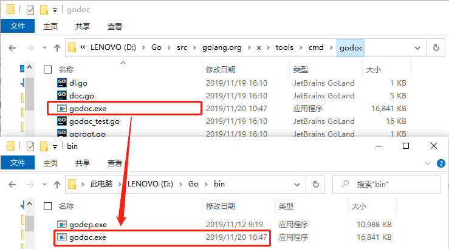
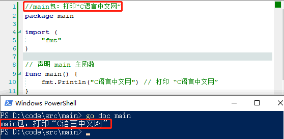

# 注释

注释在程序中的作用是对程序进行注解和说明，便于对源码的阅读。编译系统在对源代码进行编译时会自动忽略注释的部分，因此注释对于程序的功能实现不起任何作用。在源码中适当地添加注释，能够提高源码的可读性。

Go 语言的注释主要分成两类，分别是单行注释和多行注释。

- 单行注释简称行注释，是最常见的注释形式，可以在任何地方使用以`//`开头的单行注释；
- 多行注释简称块注释，以`/*`开头，并以`*/`结尾，且不可以嵌套使用，多行注释一般用于包的文档描述或注释成块的代码片段。


## 注释格式


### 代码注释

单行注释的格式如下所示：

```go
//单行注释
```


多行注释的格式如下所示：

```go
/*
第一行注释
第二行注释
...
*/
```


### 包说明

每一个包都应该有相关注释，在使用 package 语句声明包名之前添加相应的注释，用来对包的功能及作用进行简要说明。

同时，在 package 语句之前的注释内容将被默认认为是这个包的文档说明。一个包可以分散在多个文件中，但是只需要对其中一个进行注释说明即可。

在多段注释之间可以使用空行分隔加以区分，如下所示：

```go
// Package superman implements methods for saving the world.
//
// Experience has shown that a small number of procedures can prove
// helpful when attempting to save the world.package superman
```

对于代码中的变量、常量、函数等对象最好也都加上对应的注释，这样有利于后期对代码进行维护，例如下面代码中对 enterOrbit 函数的注释：

```go
// enterOrbit causes Superman to fly into low Earth orbit, a position
// that presents several possibilities for planet salvation.
func enterOrbit() error {
  ...
}
```

当开发人员需要了解包的一些情况时，可以使用 godoc 来显示包的文档说明，下面来介绍一下 godoc 工具的使用。


## godoc 工具

godoc 工具会从 Go 程序和包文件中提取顶级声明的首行注释以及每个对象的相关注释，并生成相关文档，也可以作为一个提供在线文档浏览的 web 服务器，Go语言官网（https://golang.google.cn/）就是通过这种形式实现的。

但是 Go 语言 1.13 版本移除了 godoc 工具，大家可以通过`go get `命令来获取 godoc 工具。

```shell
go get golang.org/x/tools/cmd/godoc
```


由于防火墙的原因，国内的用户可能无法通过`go get `命令来获取 godoc 工具，这时候就需要大家来手动操作了。

- 首先从 GitHub（https://github.com/golang/tools.git） 下载 golang.org/x/tools 包；
- 然后将下载得到的文件解压到 GOPATH 下的 src\golang.org\x\tools 目录中，没有的话可以手动创建；
- 打开 GOPATH 下的 src\golang.org\x\tools\cmd\godoc 目录，在该目录下打开命令行工具，并执行`go build `命令，生成 godoc.exe 可执行文件；
- 最后，将生成的 godoc.exe 文件移动到 GOPATH 下的 bin 目录中。（需要把 GOPATH 下的 bin 目录添加到环境变量 Path 中）





### 获取指定包注释

完成上述操作后就可以使用 godoc 工具了，godoc 工具一般有以下几种用法：

- go doc package：获取包的文档注释，例如`go doc fmt `会显示使用 godoc 生成的 fmt 包的文档注释；
- go doc package/subpackage：获取子包的文档注释，例如`go doc container/list`；
- go doc package function：获取某个函数在某个包中的文档注释，例如`go doc fmt Printf `会显示有关 fmt.Printf() 的使用说明。


下图演示了使用`go doc `命令来获取包的文档注释：




### 获取所有包注释

godoc 工具还可以获取 Go 安装目录下 ../go/src 中的注释内容，并将这些注释内容整合到 web 服务器中供我们预览。

启动 Web 服务器：

```shell
godoc -http=:6060
```


然后使用浏览器打开 http://localhost:6060 后，就可以看到本地文档浏览服务器提供的页面：


----

本文原始来源 [Endial Fang](https://github.com/endial) @ [Github.com](https://github.com) ([项目地址](https://github.com/endial/study-golang.git))
