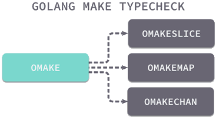

# new 与 make

Go语言中 new 和 make 是两个内置函数，主要用来创建并分配类型的内存。在我们定义变量的时候，可能会觉得有点迷惑，不知道应该使用哪个函数来声明变量，其实他们的规则很简单，**new 只分配内存**，而 **make 只能用于 slice、map 和 channel 的初始化**，下面我们就来具体介绍一下。


## new

在 Go 语言中，new 函数描述如下：

```go
// The new built-in function allocates memory. The first argument is a type,
// not a value, and the value returned is a pointer to a newly
// allocated zero value of that type.
func new(Type) *Type
```

从上面的代码可以看出，new 函数只接受一个参数，这个参数是一个类型，并且返回一个指向该类型内存地址的指针。同时 new 函数会把分配的内存置为零，也就是类型的零值。

使用 new 函数为变量分配内存空间：

```go
var sum *int
sum = new(int) //分配空间
*sum = 98
fmt.Println(*sum)
```

当然，new 函数不仅仅能够为系统默认的数据类型，分配空间，自定义类型也可以使用 new 函数来分配空间，如下所示：

```go
type Student struct {
  name string
  age int
}

var s *Students = new(Student) //分配空间
s.name ="dequan"
fmt.Println(s)
```

这里如果我们不使用 new 函数为自定义类型分配空间（将第 7 行注释），就会报错：

```shell
panic: runtime error: invalid memory address or nil pointer dereference
[signal SIGSEGV: segmentation violation code=0x1 addr=0x0 pc=0x80bd277]
goroutine 1 [running]:
```

这就是 new 函数，它返回的永远是类型的指针，指针指向分配类型的内存地址。


## make

make 也是用于内存分配的，但是和 new 不同，它只用于 chan、map 以及 slice 的内存创建，而且它返回的类型就是这三个类型本身，而不是他们的指针类型，因为这三种类型就是引用类型，所以就没有必要返回他们的指针了。

在Go语言中，make 函数的描述如下：

```go
// The make built-in function allocates and initializes an object of type
// slice, map, or chan (only). Like new, the first argument is a type, not a
// value. Unlike new, make's return type is the same as the type of its
// argument, not a pointer to it. The specification of the result depends on
// the type:
// Slice: The size specifies the length. The capacity of the slice is
// equal to its length. A second integer argument may be provided to
// specify a different capacity; it must be no smaller than the
// length, so make([]int, 0, 10) allocates a slice of length 0 and
// capacity 10.
// Map: An empty map is allocated with enough space to hold the
// specified number of elements. The size may be omitted, in which case
// a small starting size is allocated.
// Channel: The channel's buffer is initialized with the specified
// buffer capacity. If zero, or the size is omitted, the channel is
// unbuffered.
func make(t Type, size ...IntegerType) Type
```

通过上面的代码可以看出 make 函数的 t 参数必须是 chan（通道）、map（字典）、slice（切片）中的一个，并且返回值也是类型本身。

注意：make 函数只用于 map，slice 和 channel，并且不返回指针。如果想要获得一个显式的指针，可以使用 new 函数进行分配，或者显式地使用一个变量的地址。

Go语言中的 new 和 make 主要区别如下：

- make 只能用来分配及初始化类型为 slice、map、chan 的数据。new 可以分配任意类型的数据；
- new 分配返回的是指针，即类型 *Type。make 返回引用，即 Type；
- new 分配的空间被清零。make 分配空间后，会进行初始化。


## 实现原理

接下来我们将分别介绍一下 make 和 new 在初始化不同数据结构时的具体过程，我们会从编译期间和运行时两个不同的阶段理解这两个关键字的原理。


### make

我们已经了解了 make 在创建 slice、map 和 channel 的具体过程，所以在这里我们也只是会简单提及 make 相关的数据结构初始化原理。




在编译期的类型检查阶段，Go语言其实就将代表 make 关键字的 OMAKE 节点根据参数类型的不同转换成了 OMAKESLICE、OMAKEMAP 和 OMAKECHAN 三种不同类型的节点，这些节点最终也会调用不同的运行时函数来初始化数据结构。


#### new

内置函数 new 会在编译期的 SSA 代码生成阶段经过 callnew 函数的处理，如果请求创建的类型大小是 0，那么就会返回一个表示空指针的 zerobase 变量，在遇到其他情况时会将关键字转换成 newobject：

```go
func callnew(t *types.Type) *Node {
    if t.NotInHeap() {
        yyerror("%v is go:notinheap; heap allocation disallowed", t)
    }
    dowidth(t)
    if t.Size() == 0 {
        z := newname(Runtimepkg.Lookup("zerobase"))
        z.SetClass(PEXTERN)
        z.Type = t
        return typecheck(nod(OADDR, z, nil), ctxExpr)
    }
    fn := syslook("newobject")
    fn = substArgTypes(fn, t)
    v := mkcall1(fn, types.NewPtr(t), nil, typename(t))
    v.SetNonNil(true)
    return v
}
```

需要提到的是，哪怕当前变量是使用 var 进行初始化，在这一阶段也可能会被转换成 newobject 的函数调用并在堆上申请内存：

```go
func walkstmt(n *Node) *Node {
    switch n.Op {
    case ODCL:
        v := n.Left
        if v.Class() == PAUTOHEAP {
            if prealloc[v] == nil {
                prealloc[v] = callnew(v.Type)
            }
            nn := nod(OAS, v.Name.Param.Heapaddr, prealloc[v])
            nn.SetColas(true)
            nn = typecheck(nn, ctxStmt)
            return walkstmt(nn)
        }
    case ONEW:
        if n.Esc == EscNone {
            r := temp(n.Type.Elem())
            r = nod(OAS, r, nil)
            r = typecheck(r, ctxStmt)
            init.Append(r)
            r = nod(OADDR, r.Left, nil)
            r = typecheck(r, ctxExpr)
            n = r
        } else {
            n = callnew(n.Type.Elem())
        }
    }
}
```

当然这也不是绝对的，如果当前声明的变量或者参数不需要在当前作用域外生存，那么其实就不会被初始化在堆上，而是会初始化在当前函数的栈中并随着函数调用的结束而被销毁。

newobject 函数的工作就是获取传入类型的大小并调用 mallocgc 在堆上申请一片大小合适的内存空间并返回指向这片内存空间的指针：

```go
func newobject(typ *_type) unsafe.Pointer {
    return mallocgc(typ.size, typ, true)
}
```


## 总结

最后，简单总结一下 Go 语言中 make 和 new 关键字的实现原理，make 关键字的主要作用是创建 slice、map 和 Channel 等内置的数据结构，而 new 的主要作用是为类型申请一片内存空间，并返回指向这片内存的指针。


----

本文原始来源 [Endial Fang](https://github.com/endial) @ [Github.com](https://github.com) ([项目地址](https://github.com/endial/study-golang.git))