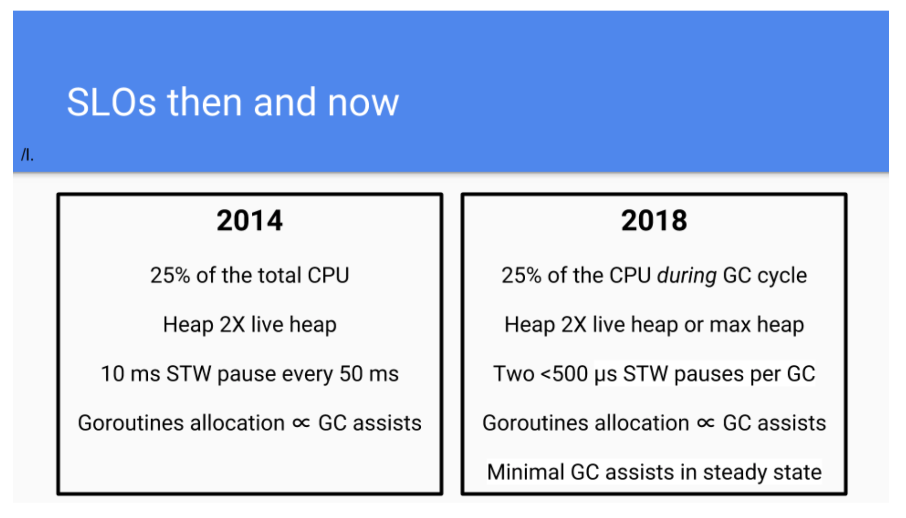

# Go语言回顾

[Go 1.13版本](https://tip.golang.org/doc/go1.13)在2019.9.3[正式发布](https://blog.golang.org/go1.13)！国外的Gopher Vincent Blanchon发表了一篇文章[《Go: Retrospective》](https://medium.com/a-journey-with-go/go-retrospective-b9723352e9b0)(科学上网阅读)，对Go从1.0版本到1.13版本做了简要的回顾，这里是那篇文章的译文。


对于每一位Go开发者来说，[Go语言的演化历程](https://tonybai.com/2018/11/12/go-opensource-9-years/)是必须要知道的事情。了解这些横跨年份发布的大版本的[主要变化](https://tonybai.com/2019/03/02/some-changes-in-go-1-12/)将有助于Gopher理解Go语言的发展理念以及该语言每个版本的优势与不足。更多关于特定版本的变更细节，可以参考[每个版本对应的Changelog](https://tip.golang.org/doc/devel/release.html)。


## [Go 1.16](https://blog.golang.org/go1.16) – 2021.2

新的 embed 包提供了在编译时使用新的`//go:embed`指令对嵌入文件的访问。现在，您可以轻松地将数据文件捆绑到您的 Go 二进制程序中，从而使 Go 的开发更加顺畅。你可以从 embed 包的文档开始学习如何使用它。Carl Johnson 也写了一篇不错的教程：["如何使用Go embed"](https://blog.carlmjohnson.net/post/2021/how-to-use-go-embed/ ""如何使用Go embed"")。

Go 1.16 还增加了对 macOS ARM64 的支持（也就是苹果M1芯片）。自从 Apple 宣布他们新的 arm64 架构以来，我们一直与他们密切合作，以确保 Go 得到全面支持；更多信息请参见我们的博客文章 ["Go on ARM and Beyond"](https://blog.golang.org/ports ""Go on ARM and Beyond"")。

请注意，Go 1.16 默认要求使用 Go module，现在，根据我们的 2020 年 Go 开发者调查，96% 的 Go 开发者已经进行了转换。我们最近增加了开发和发布模块的官方文档。

最后，还有许多其他改进和错误修复，包括构建速度提高了25%，使用的内存减少了15%。


## [Go 1.15](https://blog.golang.org/go1.15) – 2020.8

一些重要特性包括：

- Go链接器的持续优化；
- 大量小对象的内存优化；
- X.509公共名称弃用；
- GOPROXY支持跳过返回错误的代理；
- 新加入了tzdata包；
- 一些核心库的优化；


## [Go 1.14](https://blog.golang.org/go1.14) – 2020.2

defer 性能再次优化：Go1.14 提高了 defer 的大多数用法的性能，`几乎0开销`。defer 已经可以用于对性能要求很高的场景了。

time.Timer 性能提升：针对 timer 性能问题的很多优化不再有必要了。

允许嵌入具有重叠方法集的接口：`type ReadWriteCloser interface { io.ReadCloser;io.WriteCloser}` 不会报错。

testing包的T、B和TB都加上了CleanUp方法：类似 defer，清理测试申请资源。


## [Go 1.13](https://blog.golang.org/go1.13) – 2019.8

在该版本中，sync.Pool得到了改善：当垃圾回收时，pool中对象不会被完全清理掉。它引入了一个cache，用于在两次GC之前清理pool中未使用的对象实例。

逃逸分析(escape analysis)被重新实现了，在该版本中，Go得意更少地在堆上分配内存了。下面是新旧逃逸分析的基准测试对比：


图片来自 https://github.com/golang/go/issues/23109


## [Go 1.12](https://tonybai.com/2019/03/02/some-changes-in-go-1-12/) – 2019.2

该版本中，go vet基于analysis包进行了重写，使得go vet更为灵活并支持Go开发人员编写自己的checker。

更多关于analyzer的信息可以参考文章[《How to Build Your Own Analyzer》](https://medium.com/@blanchon.vincent/go-how-to-build-your-own-analyzer-f6d83315586f)。


## [Go 1.11](https://tonybai.com/2018/11/19/some-changes-in-go-1-11/) – 2018.8

Go 1.11引入了一个重要的新功能：[Go modules](https://tonybai.com/2019/06/03/the-practice-of-upgrading-major-version-under-go-module/)。Go module的引入是为了应对过去几年官方调查问卷结果中Go社区反馈的几个主要挑战：


图片来自 https://blog.golang.org/survey2018-results

另外一个重要功能是一个试验功能：支持[WebAssembly](https://webassembly.org/)。允许开发人员将Go源码编译成一个兼容四个主流浏览器的二进制格式文件。


## [Go 1.10](https://tonybai.com/2018/02/17/some-changes-in-go-1-10/) – 2018.2

在该版本中，test包引入了一个新的缓存机制，所有通过测试的结果都将被缓存下来。当test没有变化时，重复执行test会节省大量运行test的时间。

```
first run:
ok      /go/src/retro 0.027s
second run:
ok      /go/src/retro (cached)
```

go build命令也维护了一个已构建的包的缓存以加速构建性能。

该版本中垃圾回收器并没有显著性能提升。但是Go team为垃圾回收定义了一个新的SLO(Service-Level Objective)：


图片来自https://blog.golang.org/ismmkeynote


## [Go 1.9](https://tonybai.com/2017/07/14/some-changes-in-go-1-9/) – 2017.8

该版本引入了alias语法。

```
type byte = uint8
```

这里byte是unit8的一个alias。

sync包增加了Map类型，该类型支持并发访问（原生map类型不支持）。

关于map的更多信息，参考文章[“Concurrency Access with Maps”](https://medium.com/@blanchon.vincent/go-concurrency-access-with-maps-part-iii-8c0a0e4eb27e)。


## [Go 1.8](https://tonybai.com/2017/02/03/some-changes-in-go-1-8/) – 2017.2

垃圾回收器的延迟在该版本中进一步改善，延迟时间已经全面降到毫秒级别以下：


图片来自https://blog.golang.org/ismmkeynote

对延迟的优化还将继续。接下来版本的目标是将延迟降到100微秒左右。

这个版本还大幅提升了defer的性能：


图片来自 https://medium.com/@blanchon.vincent/go-how-does-defer-statement-work-1a9492689b6e

更多关于defer的信息，可以参考文章[How Does Defer statement Work?](https://medium.com/@blanchon.vincent/go-how-does-defer-statement-work-1a9492689b6e)。


## [Go 1.7](https://tonybai.com/2016/06/21/some-changes-in-go-1-7/) – 2016.8

这个版本发布了[context包](https://medium.com/@blanchon.vincent/go-context-and-cancellation-by-propagation-7a808bbc889c)。该包用于处理timeout和取消任务。

更多关于context包的信息，可参考文章：[《Context and Cancellation by Propagation》](https://medium.com/@blanchon.vincent/go-context-and-cancellation-by-propagation-7a808bbc889c)。

编译器工具链的性能得到了较大幅度优化，编译速度更快，二进制文件size更小，有些时候幅度可达20~30%。


## [Go 1.6](https://tonybai.com/2016/02/21/some-changes-in-go-1-6/) – 2016.2

这个版本的最显著变化是当使用HTTPS时，将默认支持HTTP/2。

垃圾回收器的延迟在该版本中进一步降低：


图片来自https://blog.golang.org/ismmkeynote


## [Go 1.5](https://tonybai.com/2015/07/10/some-changes-in-go-1-5/) – 2015.8

这个新版本推迟了两个月发布，目的是适应Go新的开发发布周期：每年二月和八月进行发布:


图来自：https://github.com/golang/go/wiki/Go-Release-Cycle

在该版本中，[垃圾回收器](https://golang.org/doc/go1.5#gc)被[全面重构](https://docs.google.com/document/d/1wmjrocXIWTr1JxU-3EQBI6BK6KgtiFArkG47XK73xIQ/edit#)。由于引入并发回收器，回收阶段带来的延迟大幅减少。下面是来自一个生产环境服务器上的延迟数据，我们看到延迟从300ms降到了30ms：


图片来自 https://blog.golang.org/ismmkeynote

这个版本还发布go tool trace命令，通过该命令我们可以实现执行器的跟踪(trace)。这些跟踪是在test执行、运行时生成的，跟踪信息可以通过浏览器呈现：


图片来自[原始Go Execution Tracer文档](https://docs.google.com/document/d/1FP5apqzBgr7ahCCgFO-yoVhk4YZrNIDNf9RybngBc14/pub)


## [Go 1.4](https://tonybai.com/2014/11/04/some-changes-in-go-1-4/) – 2014.12

在该版本中，Go提供了对Android的官方支持。使用[golang.org/x/mobile包](https://godoc.org/golang.org/x/mobile)，gopher们可以使用Go编写简单的Android应用。

同时，之前版本中大量用[C语言](https://tonybai.com/tag/c)和汇编语言实现的运行时已经被翻译为Go，一个更为精确的垃圾回收器让堆内存分配减少了10~30%。

和版本自身无关的是，Go工程在本次发布后已经从Mercurial迁移到Git，从Google code迁移到github。

Go还发布了go generate命令，该命令可以通过扫码代码中的//go:generate指示器来生成代码，可以帮助Gopher简化代码生成工作。

更多关于这方面的信息可以参考[Go blog](https://blog.golang.org/)和这篇文章[《Generating code》](https://blog.golang.org/generate)。


## Go 1.3 – 2014.6

该版本包含了栈管理的一个重要改进。在该版本中，栈内存分配采用**连续段(contiguous segment)**的分配模式以提升内存分配效率。这将为下一个版本将栈size降到2KB奠定基础。之前的分割栈分配方式(segment stack)存在频繁分配/释放栈段导致栈内存分配性能不稳定(较低)的问题，引入新机制后，分配稳定性和性能都有较大改善。

这里是一个json包的例子，图中显示json包对栈size的敏感度：


图来自 [contiguous stack](https://docs.google.com/document/d/1wAaf1rYoM4S4gtnPh0zOlGzWtrZFQ5suE8qr2sD8uWQ/pub)

使用连续段的栈内存分配管理模式解决了一些程序性能低下的问题。下面是html/template包的性能对stack size的敏感度图：


更多信息可参见[《How Does the Goroutine Stack Size Evolve?”》(https://medium.com/@blanchon.vincent/go-how-does-the-goroutine-stack-size-evolve-447fc02085e5)]。

这个版本还发布了sync.Pool。这个组件允许我们后面重用结构体，减少内存分配的次数。它也将成为Go生态圈中许多性能提升的源头，比如：标准库中的encoding/json、net/http或是Go社区中的zap等。

关于sync.Pool的更多信息，可以参考文章[《Understand the Design of Sync.Pool》](https://medium.com/@blanchon.vincent/go-understand-the-design-of-sync-pool-2dde3024e277)。

Go开发组在该版本中[对channel进行了优化改善](https://docs.google.com/document/d/1yIAYmbvL3JxOKOjuCyon7JhW4cSv1wy5hC0ApeGMV9s/pub)，使其性能获得提升。下面是channel在Go 1.2和Go 1.3版本中的基准测试数据对比：


## Go 1.2 – 2013.12

在该版本中，Go test命令开始支持代码测试覆盖率统计了，并且通过go提供的新子命令: go tool cover可以查看代码测试覆盖率统计信息：


图来自 https://blog.golang.org/cover

它还能提供代码覆盖信息：


图来自 https://blog.golang.org/cover


## Go 1.1 – 2013.5月

该版本主要专注于语言改善和性能提升（编译器、垃圾回收、map、[goroutine调度](https://tonybai.com/2017/06/23/an-intro-about-goroutine-scheduler/)）。这里是一个改善后的效果示意图：


图来自https://dave.cheney.net/2013/05/21/go-11-performance-improvements

这个版本同时还嵌入了一个[竞态探测器(race detector)](https://blog.golang.org/race-detector)，这个工具对于Go这种原生并发的语言是十分必要的。在[《Race Detector with ThreadSanitizer”》](https://medium.com/@blanchon.vincent/go-race-detector-with-threadsanitizer-8e497f9e42db)一文中，你可以找到有关race detector的更多详细信息。

在这个版本中的一个重点变动是[Goroutine调度器](https://docs.google.com/document/d/1TTj4T2JO42uD5ID9e89oa0sLKhJYD0Y_kqxDv3I3XMw/edit)被重写了，重写后的调度器性能大幅提升。

重写后的Go调度器的设计如下图：


图来自 https://rakyll.org/scheduler/

**M**对应的是操作系统的线程。**P**表示一个处理器（P的数量不能超过GOMAXPROCS)，每个P拥有一个本地goroutine队列。在1.1版本之前，P这个抽象并不存在。所有goroutine的调度通过全局互斥锁进行全局级别的管理。这次改进实现了”work-stealing”算法，允许某个P从其他P的队列中”偷goroutine”：


图来自 https://rakyll.org/scheduler/

更多关于[Go调度器调度原理](https://tonybai.com/2014/11/15/how-goroutines-work/)以及”work-stealing”算法的信息，可以查看Jaana B. Dogan的文章[《Go’s work-stealing scheduler》](https://rakyll.org/scheduler/)。


## Go 1.0 – 2012.3月

伴随着Go语言的第一个版本，Go的缔造者还发布了一份[兼容性文档](https://tip.golang.org/doc/go1compat)。该文档保证未来的Go版本将保持向后兼容性（backward-compatible)，即始终兼容已有的代码，保证已有代码在Go新版本下编译和运行的正确性。

Go 1.0版本还包含了[go tool pprof命令](https://tonybai.com/2015/08/25/go-debugging-profiling-optimization/)，这是一个[Google pprof C++ profiler](https://github.com/gperftools/gperftools)的变体。Go 1.0还提供了[go vet命令](https://tip.golang.org/cmd/vet/)(之前的go tool vet)，用于报告Go package中可能的错误。


----

本文原始来源 [Endial Fang](https://github.com/endial) @ [Github.com](https://github.com) ([项目地址](https://github.com/endial/study-golang.git))
