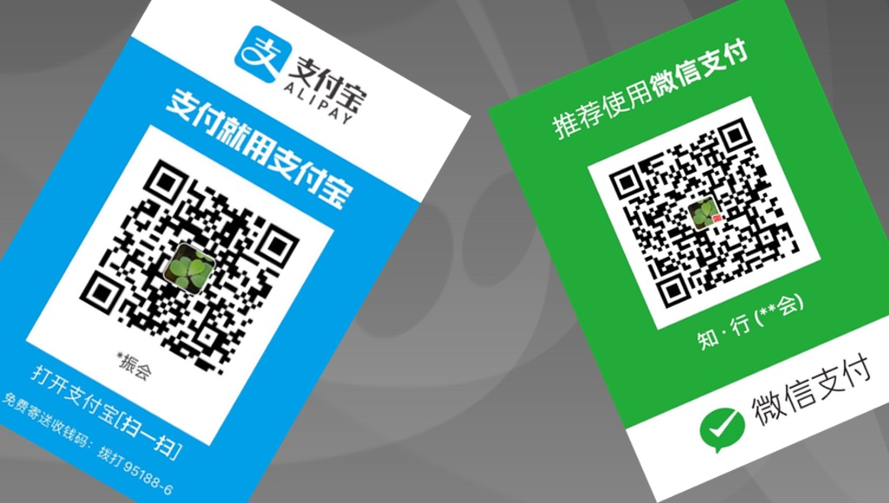

# Study GoLang

程序员的日常主要就是码代码，为了多一种码代码的工具，最近开始搬砖[GoLang(Go)](https://golang.org)。这是我在学习 Go 时的历程，因为是持续学习，所以也会持续更新，如有错误，也请读者谅解和及时反馈。

如果您有什么意见和建议，请反馈至我的个人邮箱 < `Endial@126.com` >, 如果文章有什么错误，也请给个邮件，或者在Github项目中提出，项目地址：[https://github.com/endial/study-golang](https://github.com/endial/study-golang)

本文中的相关学习资料部分参考网络公开资源，是一个学习的归纳和总结，并以`非盈利目的`公开出来提供给其他学习者参考；如果您觉得文档中引用的内容因为版权问题需要删除或需要增加参考说明，请反馈至个人邮箱，本人将第一时间处理。

### Go语言应用领域

Go 语言是谷歌2009年发布的第二款开源编程语言（系统开发语言)，它是基于编译、垃圾收集和并发的编程语言。 Go 语言专门针对多处理器系统应用程序的编程进行了优化，使用 Go 编译的程序可以媲美 C / C++代码的速度，而且更加安全、支持并行进程。作为出现在21世纪的语言，其近 C 的执行性能和近解析型语言的开发效率，以及近乎于完美的编译速度，已经风靡全球。特别是在云项目中，大部分都使用了 Go 来开发。不得不说， Go 早已深入人心。而对于一个没有历史负担的新项目， Go 或许就是个不二的选择。

## 学习目录

### 01. [GoLang入门](./01-Golang入门/README.md)

主要介绍GoLang语言的基本语法、函数、运算符等基础知识。[传送门在这里](./01-Golang入门/README.md)

### 02. [GoLang进阶](./02-Golang进阶/README.md)

主要介绍GloLang的进阶应用及技术。[传送门在这里](./02-Golang进阶/README.md)

## 其他

学习并整理输出文档资料不容易，如果您看后觉得有收获，希望鼓励作者提提神，请打赏作者喝咖啡吧。

  

## 参考资料及感谢说明

感谢说明：

感谢相关读者的[建议或打赏](./docs/thanks.md)。

参考资料：

  - 
